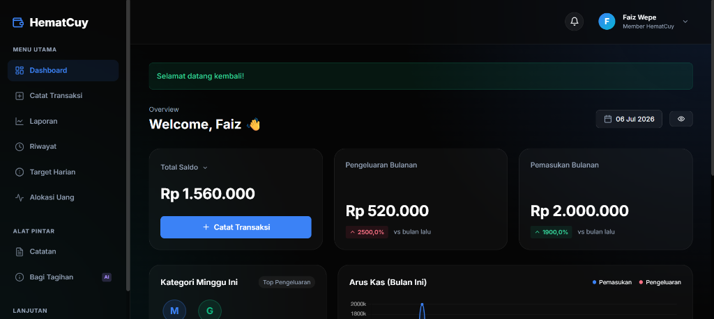

# 💸 HematCuy

**HematCuy** adalah aplikasi pencatatan keuangan pribadi berbasis web yang dikembangkan menggunakan **Laravel**. Aplikasi ini didesain dengan antarmuka modern, elegan, dan *user-friendly* untuk membantu pengguna melacak pengeluaran, merencanakan anggaran bulanan, dan mencapai tujuan finansial (wishlist) dengan lebih mudah.

---

## 🌟 Fitur Utama

- **📊 Dashboard Analitik**: Tampilan ringkas berisi total saldo (Tunai & Bank), grafik pengeluaran mingguan/bulanan, serta riwayat transaksi terbaru.
- **📝 Catat Transaksi**: Catat setiap arus kas masuk (Pemasukan) dan arus kas keluar (Pengeluaran) secara detail berdasarkan kategori.
- **🎯 Budgeting (Alokasi Dana)**: Tetapkan alokasi anggaran bulanan untuk setiap kategori (makanan, transportasi, dll) dan pantau persentase penggunaannya.
- **📖 Hutang & Piutang**: Kelola uang yang dipinjamkan ke orang lain (Piutang) dan uang pinjaman Anda (Hutang), lengkap dengan sistem pembayaran cicilan.
- **🎁 Wishlist (Tabungan Impian)**: Rencanakan pembelian barang impian Anda. Anda dapat mencicil tabungan ke dalam wishlist hingga target tercapai.
- **📑 Laporan Keuangan**: Unduh atau lihat laporan pengeluaran & pemasukan secara detail untuk mengevaluasi kondisi finansial.
- **📒 Catatan Keuangan**: Tulis catatan ringan atau pengingat seputar keuangan Anda (misal: "Bayar listrik tanggal 20!").

---

## 🚀 Teknologi yang Digunakan

- **Framework**: [Laravel 11](https://laravel.com)
- **Database**: MySQL / SQLite (Sesuai konfigurasi env)
- **Styling**: Custom CSS dengan desain *Glassmorphism* & *Modern Dark-Mode* UI.
- **Icons**: SVG & FeatherIcons.

---

---

## 💡 Keunggulan HematCuy

- **Sistem Saldo Terintegrasi**: Mencatat pengeluaran, hutang-piutang, maupun wishlist secara otomatis akan langsung memotong/menambah Saldo Kas & Bank Anda, sehingga Anda selalu mendapatkan data *real-time*.
- **Peringatan Saldo Minus**: Mencegah input transaksi yang melampaui sisa uang Anda, memastikan validitas cash-flow.
- **Desain Premium**: Pendekatan UI/UX yang *clean*, tidak membosankan, dilengkapi dengan *micro-animations* untuk pengalaman pengguna yang interaktif.

---

## 📄 Lisensi

Aplikasi ini bersifat *open-sourced* dan dilisensikan di bawah [MIT license](https://opensource.org/licenses/MIT).
